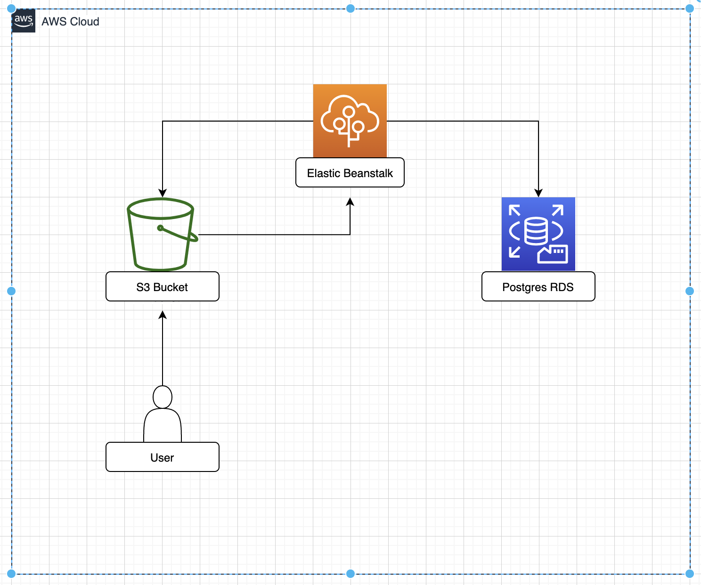
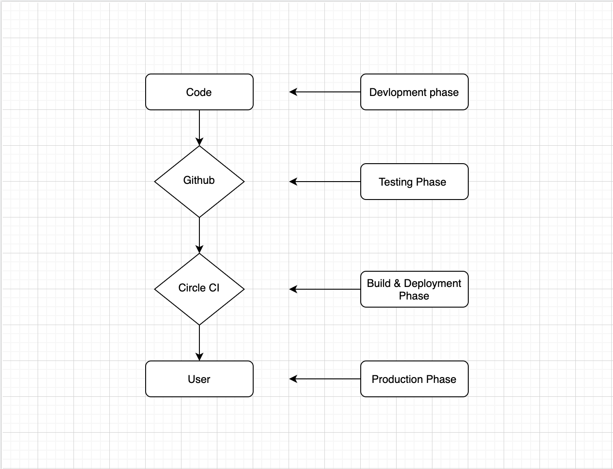

## Infrastructure

1. Github
2. Circle CI
3. Postgress with AWS RDS
4. AWS S3
5. AWS Elastic Beanstalk




## Pipeline process
1. Github stores the code
2. Circle CI listens for changes to master branch and starts the build when new changes are merged to the branch.
3. After build is succesfull, Circle CI will deploy the changes to S3 and to AWS Elastic Beanstalk.
4. S3 will show the user the index.html so that he can use it.



### Environment variables

```
POSTGRES_USERNAME
POSTGRES_PASSWORD, 
POSTGRES_DB
POSTGRES_PORT
POSTGRES_HOST, 
PORT
AWS_REGION
AWS_PROFILE, 
AWS_BUCKET
URL
JWT_SECRET, 
AWS_ACCESS_KEY_ID,
AWS_SECRET_ACCESS_KEY
```
